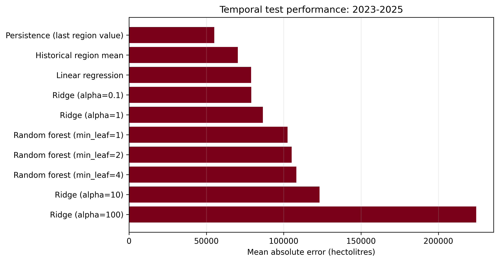

# Predicting Annual Wine Production by Viticultural Region in Portugal

**Course:** Practical Machine Learning, Master's in Green Data Science, 2025/2026 
**Institution:** Instituto Superior de Agronomia, Universidade de Lisboa 
**Team:** Andrea Dombe (27119), Dandara França (27916), Fernanda Chácara (26298)

## Abstract

This project evaluates whether annual wine production can be predicted for 14
Portuguese viticultural regions using official historical statistics. Wine
production and vineyard-area series from the Instituto da Vinha e do Vinho
(IVV) were cleaned, standardized, and joined by region and campaign start year.
The resulting modelling dataset contains 238 region-year observations from
2009 to 2025. Because this is a forecasting problem, all evaluation procedures
respect chronological order. Candidate models were compared through expanding
rolling-origin validation over 2018-2022, while 2023-2025 remained an untouched
test period. The comparison included persistence and historical-mean baselines,
linear regression, Ridge regression, and random forests. Linear regression had
the lowest validation MAE among the machine-learning models (58,180 hl), but on
the final test period the persistence baseline was substantially better (MAE
55,139 hl) than linear regression (78,982 hl). The result indicates that region
and vineyard area explain cross-sectional production differences, while the
available features do not reliably explain year-to-year changes. More credible
operational forecasts will require lagged production, weather, and other
time-varying predictors.

## 1. Introduction

Wine production is an important agricultural and economic activity in Portugal.
Production varies strongly between regions and from one campaign to the next,
creating a relevant forecasting problem for producers, public authorities, and
supply-chain planning. The objective of this project is to estimate annual total
wine production, in hectolitres, for each Portuguese viticultural region.

The work addresses two questions:

1. How accurately can regional production be estimated using region, campaign
   year, and vineyard area?
2. Do standard regression models improve on transparent temporal baselines?

The second question is essential. A high coefficient of determination can occur
simply because regions have very different production scales. A useful model
must therefore be compared with simple forecasts and evaluated only on future
years that were unavailable during training.

## 2. Data

### 2.1 Sources and variables

Both source datasets are official IVV statistical workbooks included in the
repository:

- annual wine production by viticultural region;
- annual total vineyard area in Portugal by region.

The processed production table contains 238 observations, covering 14 regions
and campaign start years from 2009 to 2025. It includes total production and the
DOP, IGP, year/variety, and non-certified components. The processed vineyard
table contains 288 observations from 1989 to 2025. The prediction target is
`total_production_hl`. The predictors used in the final comparison are `region`,
`year_start`, and `vineyard_area_ha`.

### 2.2 Cleaning and transformation

The raw IVV workbooks contain Portuguese-formatted numbers, repeated campaign
headings, and several production subtables. The cleaning notebooks:

- normalize region and campaign labels;
- detect the relevant tables and campaign columns;
- convert Portuguese decimal and thousands separators;
- reshape production categories into one row per region and year;
- test uniqueness of region-year keys;
- reject implausibly large values and components larger than total production;
- save UTF-8 processed CSV files.

Production and area are left-joined by region and `year_start`. Vineyard area is
missing for 38 early region-year observations. Missing values are imputed using
the training-set median inside the scikit-learn pipeline, with an additional
missingness indicator. This prevents information from validation or test years
from entering the imputation estimate.

No DOP, IGP, or other production component is used as a predictor because these
components are measured for the same campaign and would leak information about
the target total.

## 3. Data organization and validation

Random train-test splitting would allow future campaigns to influence models
evaluated on earlier campaigns. Instead, model development uses expanding
rolling-origin validation:

- validation years: 2018, 2019, 2020, 2021, and 2022;
- for each validation year, training uses only earlier years;
- validation predictions from all five folds are pooled for MAE, RMSE, and R²;
- final test years: 2023, 2024, and 2025;
- after model selection, models are refitted using all observations through 2022.

All regions can occur in multiple years, so observations within a region are
correlated. Keeping complete years together prevents same-year leakage and
reflects the intended forecasting use. The final test set contains 42
observations: 14 regions across three campaigns.

## 4. Methods

### 4.1 Baselines

Two non-ML baselines establish the minimum useful performance:

- **Persistence:** the most recent observed production for the same region;
- **Historical regional mean:** the mean of all earlier production values for
  the same region.

Fallback predictions use the global training mean if a previously unseen region
appears.

### 4.2 Machine-learning models

The modelling pipeline median-imputes numeric values, adds a missing-value
indicator, standardizes numeric predictors, and one-hot encodes region. Three
model families are compared:

- ordinary least-squares linear regression;
- Ridge regression with alpha values 0.1, 1, 10, and 100;
- random-forest regression with 500 trees, `max_features=0.8`, and minimum leaf
  sizes 1, 2, and 4.

Random forests use a fixed random seed of 42. Hyperparameter choices are ranked
using validation MAE. MAE is the primary metric because it is directly
interpretable in hectolitres; RMSE highlights large errors; R² describes the
proportion of test-set variation explained.

## 5. Results

### 5.1 Rolling-origin validation

| Model | MAE (hl) | RMSE (hl) | R² |
|---|---:|---:|---:|
| Linear regression | 58,180 | 84,156 | 0.970 |
| Historical regional mean | 58,464 | 89,739 | 0.966 |
| Ridge, alpha 0.1 | 59,695 | 85,167 | 0.969 |
| Random forest, min. leaf 2 | 62,630 | 102,685 | 0.956 |
| Persistence | 70,220 | 115,756 | 0.944 |

Linear regression achieved the lowest rolling-validation MAE and was therefore
the selected ML model before inspection of the final test results. Its advantage
over the historical regional mean was small: approximately 284 hl in MAE.

### 5.2 Final chronological test

| Model | MAE (hl) | RMSE (hl) | R² |
|---|---:|---:|---:|
| Persistence | **55,139** | **98,771** | **0.961** |
| Historical regional mean | 70,377 | 117,842 | 0.945 |
| Linear regression | 78,982 | 115,420 | 0.947 |
| Ridge, alpha 0.1 | 79,058 | 116,690 | 0.946 |
| Random forest, min. leaf 1 | 102,482 | 237,583 | 0.777 |

The simple persistence baseline was the best method on 2023-2025. Linear
regression retained a high R² but had approximately 43% higher MAE than
persistence. Random forests produced much larger errors, particularly for
high-production regions, and did not generalize well to the most recent period.

Detailed metrics and observation-level predictions are available in
`outputs/tables/model_comparison.csv` and
`outputs/tables/test_predictions.csv`.

## 6. Analysis and discussion

The original baseline notebook reported R² around 0.95 and described the model
as performing well. The stronger evaluation changes that interpretation. Much
of the R² comes from stable scale differences between regions: Douro, Lisboa,
Alentejo, and Verdes generally produce far more wine than smaller regions. A
model can explain this cross-sectional variation while still missing annual
movements.

The persistence result suggests that recent region-specific production contains
more short-term information than a common linear trend. Vineyard area changes
slowly and is useful for distinguishing regional scale, but it cannot represent
weather shocks, disease pressure, harvest conditions, or management decisions.
The random forest also has only 196 pre-test observations and must extrapolate
to later years, a setting in which tree models are weak.

The correct conclusion is therefore not that machine learning has solved the
forecasting problem. With the current features, the defensible operational
forecast is persistence. The ML models remain useful as diagnostic comparisons
and show what information is missing.

## 7. Limitations and future work

The study is limited by a small regional panel, aggregated observations, and
only three predictors. Vineyard area for a campaign must also be available at
the moment a forecast is issued; otherwise its contemporaneous use would not be
operationally realistic.

Future work should add predictors known before harvest, including lagged
production, rainfall, growing-degree days, extreme heat, drought indices, and
possibly disease or remote-sensing indicators. Lag features must be constructed
within each region and evaluated with the same temporal discipline. Prediction
intervals or quantile models would communicate uncertainty more honestly than
single point estimates.

### 7.1 Experimental one-year-ahead extension

After the primary comparison, an additional experimental workflow was created
in `04_future_forecast_simulator.ipynb`. It uses the previous two campaigns,
the mean of the previous three campaigns, the latest production change,
vineyard area, region, and year. Every lag is shifted within region before the
target campaign, so the target itself is never used as an input.

With the same rolling-validation years, a random forest with lag features had
the best validation MAE (52,314 hl). In one-step-ahead tests over 2023-2025, it
obtained MAE 59,026 hl versus 69,403 hl for previous-campaign persistence. This
test differs from the primary fixed-origin three-year holdout because each
campaign may use the immediately preceding observed campaign. The two results
therefore answer different forecasting questions and should not be compared as
if their information sets were identical.

The selected lag model was refitted through 2025 to generate experimental
2026/27 forecasts. The simulator defaults to the latest observed vineyard area
and allows a user-supplied area scenario. Reported lower and upper values use
the 90th percentile of absolute rolling-validation errors (147,976 hl) as a
symmetric empirical error band. This is a practical uncertainty indication,
not a formal probabilistic confidence interval.

Deployment was considered optional and was not prioritized because a reliable
predictive advantage over the persistence baseline has not yet been established.

## 8. Conclusions

This project built a reproducible, leakage-resistant comparison for annual wine
production across Portuguese viticultural regions. Linear regression was the
best ML candidate in the primary fixed-origin comparison, but persistence was
more accurate on its untouched 2023-2025 test period. A separate one-step-ahead
extension showed that lagged production can improve on persistence under a
different, operationally later information set. The main contribution is thus
both a modelling pipeline and an evidence-based diagnosis: region and vineyard
area explain structural differences, while year-ahead prediction benefits from
recent time-varying information and must state exactly what is known at forecast
time.

## 9. Contributions

The team must replace the entries below with an accurate account before final
submission; academic contributions cannot be inferred safely from repository
files alone.

| Team member | Contribution to confirm |
|---|---|
| Andrea Dombe | Data preparation / analysis / writing: **confirm exact tasks** |
| Dandara França | Data preparation / analysis / writing: **confirm exact tasks** |
| Fernanda Chácara | Data preparation / analysis / writing: **confirm exact tasks** |

## 10. References

1. Instituto da Vinha e do Vinho. *Evolução da Produção Nacional por Região
   Vitivinícola*. <https://www.ivv.gov.pt/np4/163.html>
2. Instituto da Vinha e do Vinho. *Evolução da Área Total de Vinha - Portugal*.
   <https://www.ivv.gov.pt/np4/10586.html>
3. Pedregosa, F. et al. (2011). Scikit-learn: Machine Learning in Python.
   *Journal of Machine Learning Research*, 12, 2825-2830.
4. Breiman, L. (2001). Random Forests. *Machine Learning*, 45, 5-32.
5. Hyndman, R. J., & Athanasopoulos, G. (2021). *Forecasting: Principles and
   Practice* (3rd ed.). OTexts.
